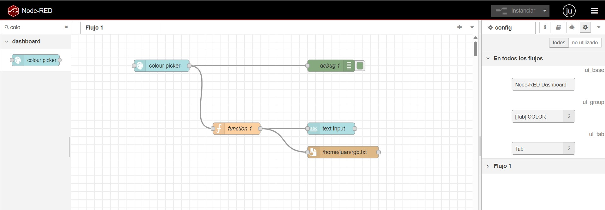
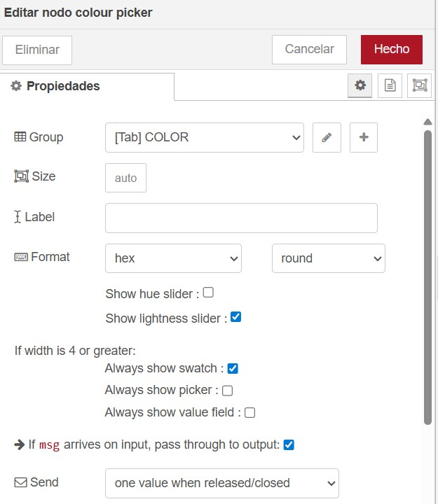
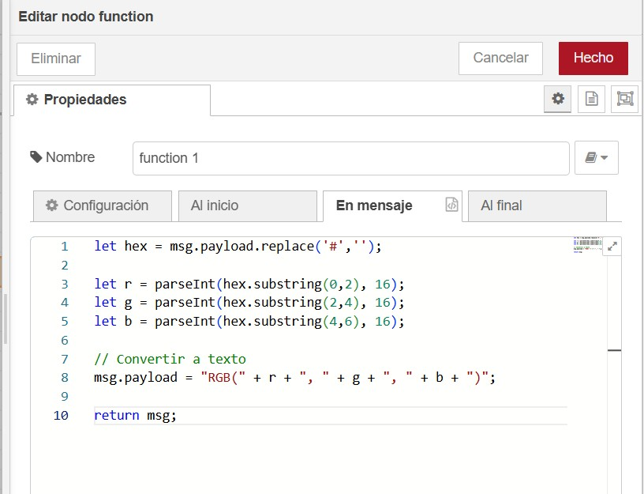
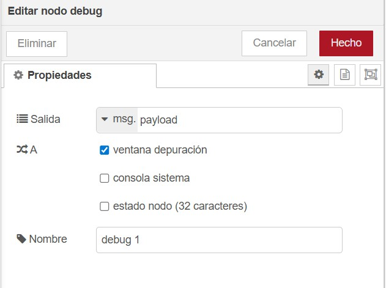
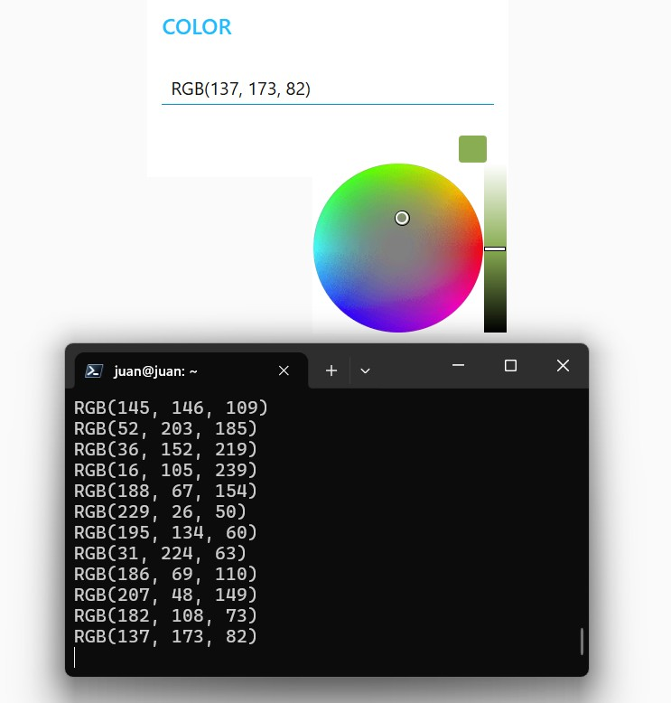

# Lab04: Visualización de Datos en Raspberry Pi con Node-RED 

## Integrantes

* [Juan Camilo Yepes](https://github.com/JuanCY99)
* [Cristian Javier Romero ](https://github.com/crisr2215)
* [Kevin Mejia Montenegro](https://github.com/coronavirus-ux)

## Documentación

### Objetivo

Implementar mediante esta configuracion en NODE RED, un selewctor de colores en donde pase el color seleccionado de HEX  RGB y se pueda visualizar en terminal.

### Desarrollo

El sistema se construyó bajo una arquitectura de flujo de datos continuo, dividido en tres etapas principales:

3.1. Captura del Dato (Interfaz de Usuario)
Se implementó un nodo colour picker en el Dashboard de Node-RED. Al interactuar con la paleta de colores desde un navegador web conectado a la IP de la Raspberry Pi, este nodo genera un mensaje mediantemsg.payload que contiene el color seleccionado en una cadena de texto con formato Hexadecimal por ejemplo, #ff5833.

Procesamiento y Conversión 
El núcleo del procesamiento se realiza en el nodo function 1. Aquí se programó un script en JavaScript que intercepta el msg.payload entrante. El algoritmo desarrollado realiza lo siguiente:

Elimina el símbolo # de la cadena de texto si está presente.

Divide los 6 caracteres restantes en tres pares de 2 caracteres, correspondientes a los canales Rojo (R), Verde (G) y Azul (B).

Convierte cada par de base 16 (Hexadecimal) a base 10 (Decimal).

Empaqueta los tres nuevos valores en un nuevo formato ( RGB: 255, 87, 51) y lo devuelve como el nuevo msg.payload.

Salida y Visualización de Datos:

La salida del nodo de función se bifurca hacia dos nodos distintos para garantizar la trazabilidad:

Nodo Text Input: Actualiza la interfaz gráfica del usuario mostrando el valor RGB resultante.

Nodo Write File: Escribe el valor convertido en un archivo de texto dentro del sistema de archivos de la Raspberry Pi (por ejemplo, /home/pi/color_log.txt). Esto permite que un usuario conectado a la Raspberry Pi vía SSH pueda visualizar los datos directamente desde la terminal utilizando comandos del sistema operativo como cat o tail -f.

Nodo Debug: Muestra el resultado RGB directamente en el panel de depuración de la interfaz de desarrollo de Node-RED.

4. Pruebas y Resultados

Para validar el funcionamiento del sistema, se ejecutaron pruebas seleccionando colores aleatorios en el colour picker:

Al seleccionar un color aleatorio , el sistema capturó #ff91926d, la función lo procesó adecuadamente y la terminal de la Raspberry Pi registró la salida 145, 146, 109.

El nodo write file logró registrar los datos sin problemas de permisos, y el uso del comando tail -f en la terminal permitió ver cómo los valores RGB cambiaban en tiempo real cada vez que se movía el cursor en la paleta de colores.
Teniendo la mediante la interfaz de usuario acceso a una gran variedad de colores de manera visual y pudiendo seleccionarlos de forma manual se relizaron varias iteraciones para la validación de la respuesta en la terminal de la raspberry teniendo para éstas iteraciones el siguiente resultado:

Se puede evidenciar que el último color seleccionado corresponde al último que aparece en la terminal de la raspberry.

## Conclusiones

Se comprobó la eficacia de Node-RED como herramienta de Edge Computing, permitiendo que la Raspberry Pi Zero 2W no solo sirva páginas web, sino que procese transformaciones de datos locales de manera eficiente mediante nodos de función.

El uso de nodos del sistema de archivos (write file) demostró ser un puente excelente para comunicar el entorno visual de Node-RED con la interfaz de línea de comandos del sistema operativo Linux de la Raspberry.

La lógica matemática de conversión de bases numéricas (Hexadecimal a Decimal) implementada en JavaScript resultó ser rápida y fiable para aplicaciones de interfaz en tiempo real.